# CM4108256 - CM4 module with 256GB eMMC

## Project description

The aim of the project was to modify the eMMC memory (by soldering) from the default 32GB (SAMSUNG KLMBG2JETD-B041) to 256GB (SanDisk SDINBDD4-256G), ie to create a unique, custom CM4108256 ("Little Big Monster") configuration, which is not available on the market.
For this purpose, a brand new Raspberry Pi CM4 module was used in the maximum configuration: 8GB RAM + 32GB eMMC + WiFi (CM4108032).

## EMMC memory
The following model (v5.1 standard) was used as eMMC memory: SanDisk iNAND7350, part number SDINBDD4-256G, in the BGA153 package.
https://www.sandisk.com/content/dam/sandisk-main/en_us/assets/resources/data-sheets/iNAND-7350-Prod-Brief.pdf

The memory was bought on the Aliexpress portal for about $90.

## Execution
1. First, the eMMC memory chip was desoldered.
2. Next, by cleaning of the soldering pads, place for soldering a new memory has been prepared.
2. Then the first attempt was made to solder the eMMC 256GB chip. Unfortunately, the chip was soldered inaccurately and crookedly, so it was necessary to clean the pads and re-solder the memory chip.
3. Before re-soldering, it was necessary to perform BGA reballing of the eMMC system with steel stencil.
4. The second attempt to solder the memory chip was successful and the eMMC memory was detected after starting the CM4 module.

## Photos

CM4108256 module (with soldered 256GB eMMC chip):
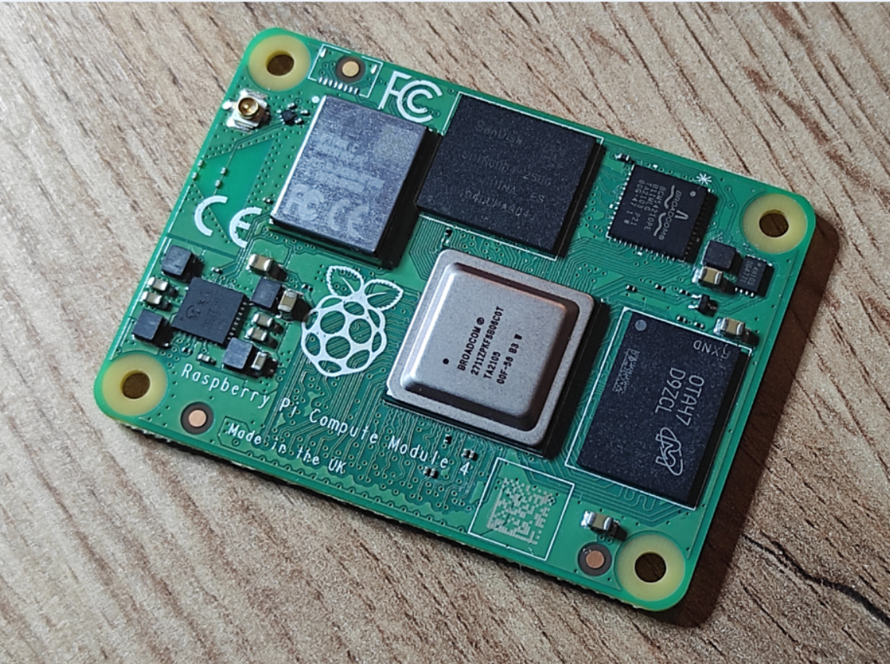

CM4108256 module (with soldered 256GB eMMC chip):

CM4108256 module (with soldered 256GB eMMC chip):

CM4108256 module (with soldered 256GB eMMC chip):

Original CM4108032 module:
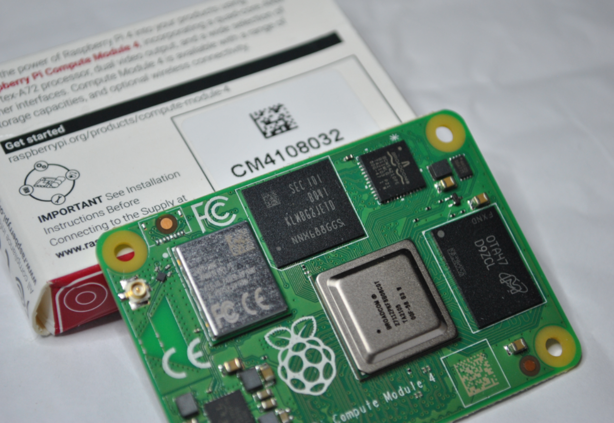

Both eMMC chips:
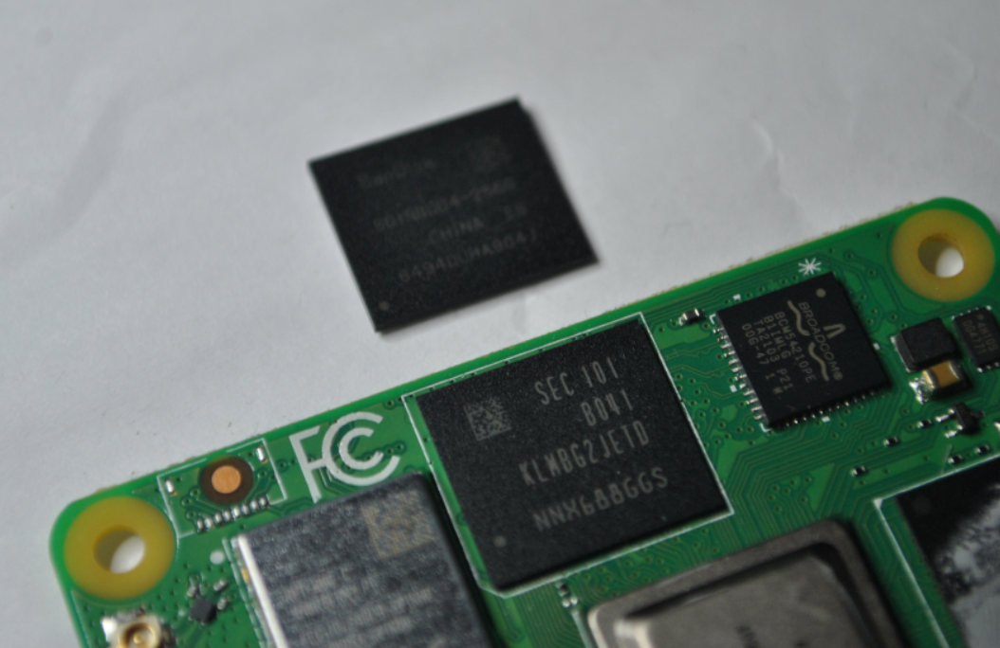

Both eMMC chips:

After desoldered original BGA eMMC chip:

Cleaned up BGA pads:
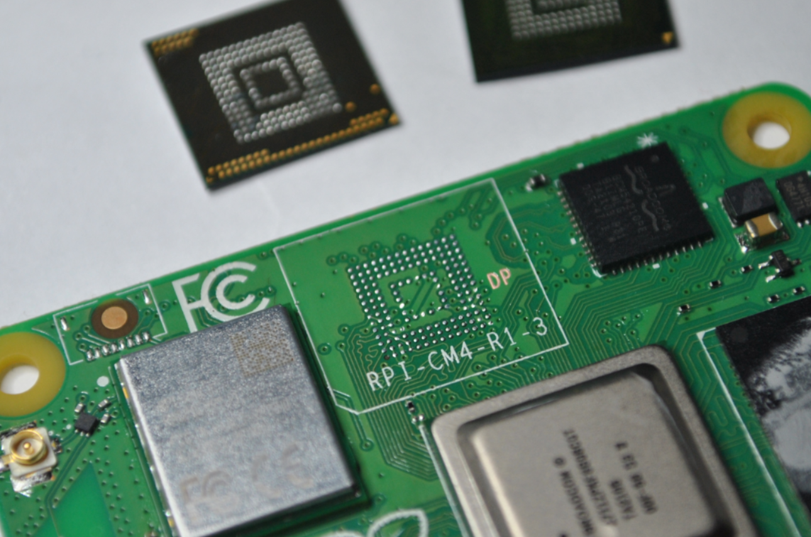

CM4 module ready for soldering new eMMC chip:

SanDisk 256GB eMMC chip ready to solder:
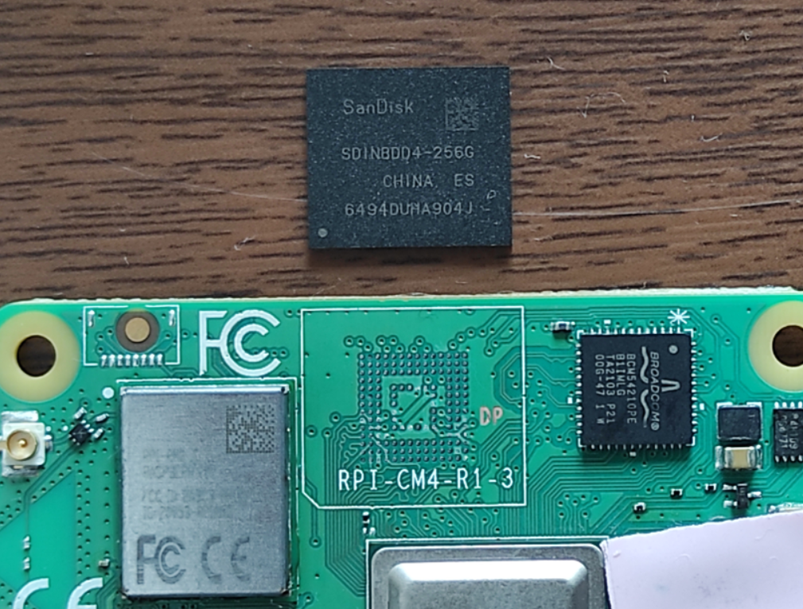

First attempt failed, eMMC chip require BGA reballing:
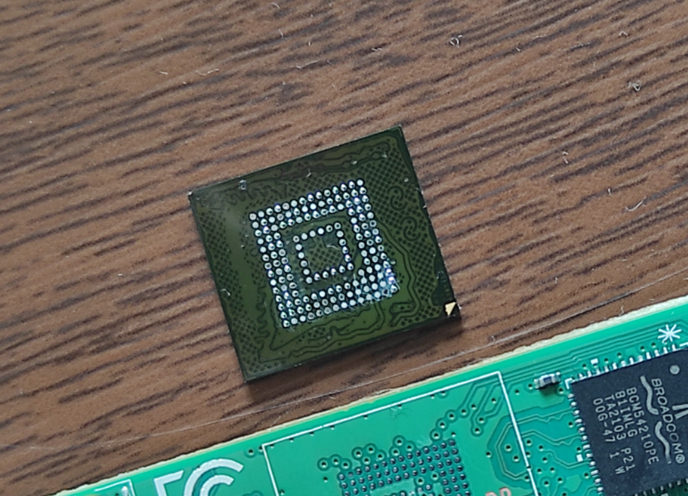

Cleaned up again BGA footprint:

BGA reballing by using steel stencil:
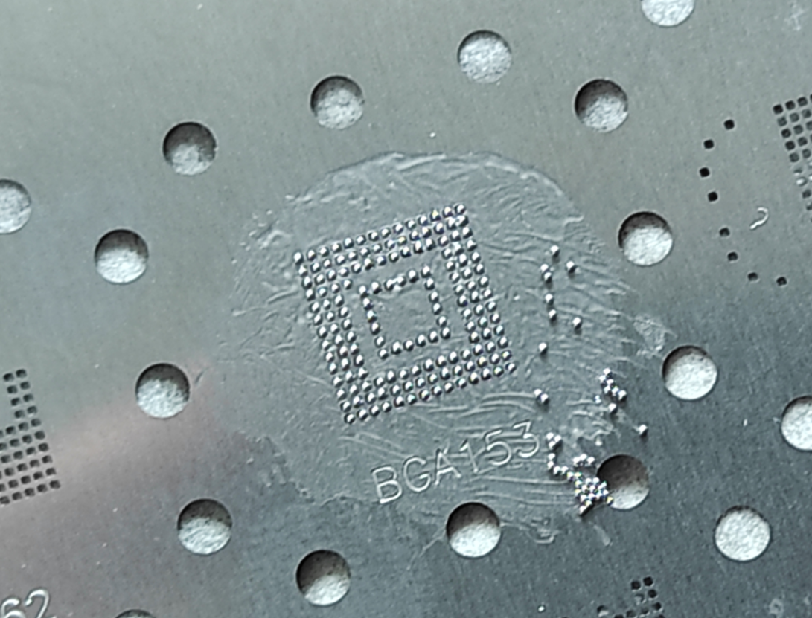

CM4 module during flashing new 256GB eMMC chip:
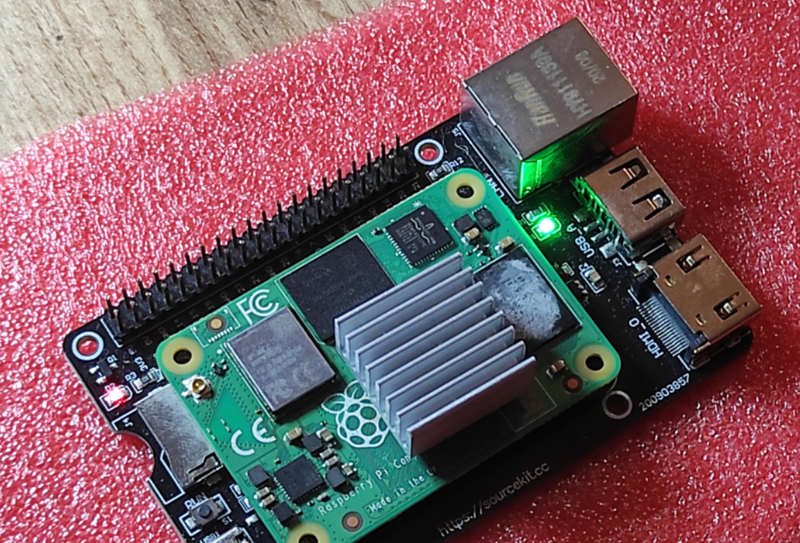

SMT steel stencil:

CM4108256 during testing:
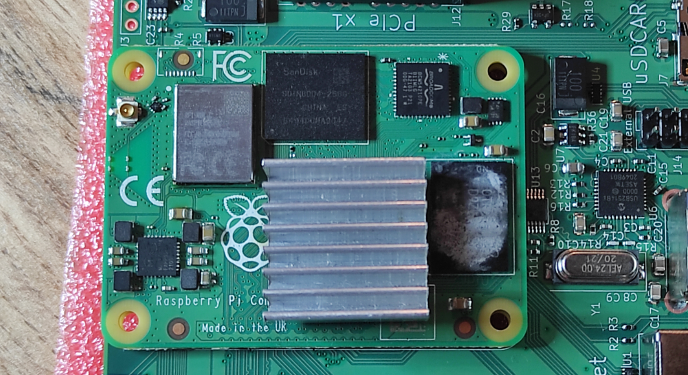

BGA balls (Sn63Pb37, 0.3mm size) for reballing:

BGA balls:

During tests:

Desoldered eMMC chip (SAMSUNG 32GB KLMBG2JETD-B041):
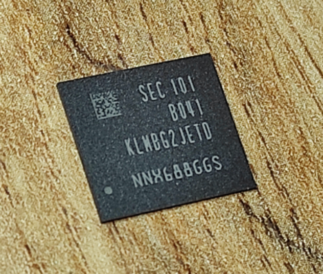

Samsung eMMC chip after cleaning:

CM4108256 module:

SanDisk SDINBDD4-256G chip:

Raspberry Pi Imager during flashing eMMC chip:
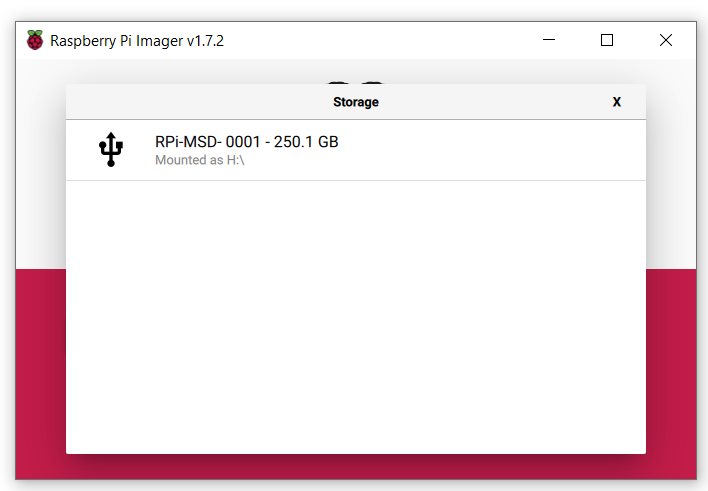

GParted tool: properties of 256GB eMMC memory: 

Benchmark of 256GB chip:

Benchmark of original 32GB chip:

